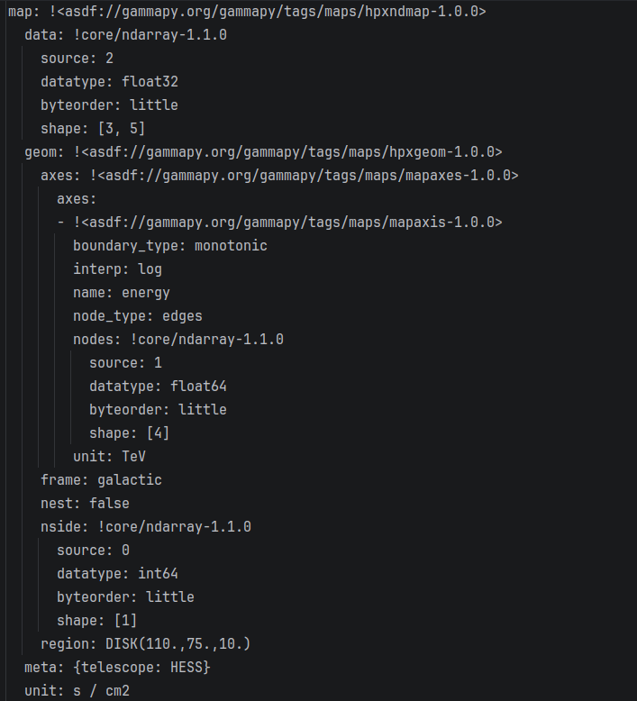

# Final Report - Google Summer of Code 2026

**Organization:** NumFOCUS 

**Sub-organization**: [Gammapy](https://github.com/gammapy/gammapy)

**Project:** [Serialization of Map and Model Classes into ASDF ](https://summerofcode.withgoogle.com/programs/2026/projects/KCUx8CEu)

**Contributor:** [Basmala Hekal](https://github.com/Basmala92)

**Mentors:** [Régis Terrier](https://github.com/registerrier), [Kirsty Feijen](https://github.com/Astro-Kirsty)

## Project Overview

### Aim
Serialize Gammapy’s data products and model objects to ASDF (Advanced Scientific Data Format).

### Description
Gammapy currently serializes its data products across multiple formats: FITS files
for `Map` objects, and YAML files for `Dataset` and `Model` objects. This fragmented
workflow complicates metadata handling and means no single format can represent a
full analysis end to end.

Up till now, Gammapy data product serialization has relied partly on the documented Gamma Astro Data Format (GADF)
and partly on internal undocumented structures, which breaks the FAIR (Findable, Accessible, Interoperable, and Reusable)
compliance of Gammapy’s products.

Additionally, current IO code in Gammapy is mixed with the data handling code 
with no clear separation of concerns.

### Solution
Most scientific data formats have a limitation: they focus either on the
data or on metadata flexibility, but rarely both. ASDF strikes a middle
ground, storing everything in one self-contained, human-readable file:

- A YAML header storing all metadata and structural information.
- Numerical data stored in binary blocks immediately following the header,
  linked back to their YAML attributes.

Unlike FITS, ASDF supports hierarchical data structures, mapping naturally
onto Gammapy's own nested class relationships.
It is also easily extensible, and supports memory mapping, flexible compression, and
schema-based validation, giving every serialized field a documented structure that ASDF automatically checks on every read
and write.
This directly addresses the fragmentation and the gaps described above, making ASDF a FAIR-compliant format for
Gammapy's data products.


This project is the first implementation of fully separated IO code inside
Gammapy. 


## Work Completed

Over the summer, I implemented ASDF serialization
for 16+ core Gammapy classes across 12 pull requests (axes,
geometries, map, `Maps`, `GTI`, and the IRF map family).


**Project Tracking**: [View the full Gammapy ASDF project board](https://github.com/orgs/gammapy/projects/42/views/2).
### Implementation strategy

ASDF is a hierarchical format, therefore to serialize a class, every
attribute that is used to reconstruct it must itself be serializable.
I followed a bottom-up approach, ordering classes by dependency, 
starting with `MapAxis` and ending with `Datasets`.

#### For each Gammapy class the following must be implemented:

- **Schema:** A YAML schema that has a unique URI and validates the object, its properties on read/write,
including their data types and whether each is required.

- **Converter:** A class that contains a list of tags and types handled by this converter 
and mainly two functions:
  * `to_yaml_tree()`: Accepts the Python object and maps its attributes inside a node (dict) to be stored as YAML on write.
  * `from_yaml_tree()`: Accepts a node from the YAML tree to reconstruct the Python object back on read.

- **Tag:** A unique URI (Uniform Resource Identifier) identifies the object and links it to the right converter.

- **Manifest:** `gammapy-1.0.0.yaml` links every tag to its schema.

- **Extension**: `GAMMAPY_EXTENSIONS` combines the manifest with the full list of Gammapy converters via `ManifestExtension.from_uri()`, 
so that for every registered tag, ASDF knows both which schema validates it and which converter reads/writes it.

To let ASDF automatically discover and use Gammapy's serialization support without any manual setup, 
I registered two entry points in `pyproject.toml`: 
 * `asdf.extensions` which exposes the converters and manifest.
 * `asdf.resource_mappings` which exposes the schema and manifest files themselves so ASDF can resolve and validate against them.

### Testing
* For every serialized class, I created round-trip tests confirming the object and its attributes remain identical after being written and read back.
* For some classes, I also hand wrote YAML examples to test schema validation directly, including invalid cases that should correctly raise a `ValidationError`.

### Merged pull requests

The following classes are fully implemented, tested, and merged:

**Axis Classes:**

[#6706](https://github.com/gammapy/gammapy/pull/6706):
* Created io sub-package for ASDF inside Gammapy.
* Serialization for `MapAxis` class.

[#6722](https://github.com/gammapy/gammapy/pull/6722): Serialization for `TimeMapAxis` and `LabelMapAxis` class.

[#6735](https://github.com/gammapy/gammapy/pull/6735): Serialization for `MapAxes` class which is a list of Axis classes that is tagged in its schema.

**Geometry classes:**

[#6751](https://github.com/gammapy/gammapy/pull/6751): Serialization for `WcsGeom` class.

[#6761](https://github.com/gammapy/gammapy/pull/6761): Serialization for `HpxGeom` class.

[#6771](https://github.com/gammapy/gammapy/pull/6771): Serialization for `RegionGeom` class.

**Map classes:**

[#6790](https://github.com/gammapy/gammapy/pull/6790): Serialization for `WcsNDMap` class.

[#6791](https://github.com/gammapy/gammapy/pull/6791): Serialization for `HpxNDMap` class.

[#6794](https://github.com/gammapy/gammapy/pull/6794): Serialization for `RegionNDMap` class.

[#6830](https://github.com/gammapy/gammapy/pull/6830): Serialization for `Maps` class which is a dict of any `NDMap` object.

**GTI class:**

[#6831](https://github.com/gammapy/gammapy/pull/6831): Serialization for `GTI`(Good Time Intervals) class.


**IRFMap classes:**

[#6833](https://github.com/gammapy/gammapy/pull/6833):
Created a shared base converter (`IRFMapConverter`) that `PSFMap`, `RecoPSFMap`, `EDispMap`, and `EDispKernelMap` all inherit from, 
since they share nearly identical structure but need distinct tags.

### Using the project
**On write:** The user creates a file with `asdf.AsdfFile()` and assigns their
object to it. `GAMMAPY_EXTENSIONS` locates the correct converter using the
object's tag/type, finds the matching schema via the manifest, validates
the object against that schema, and calls `to_yaml_tree()` to serialize it.

**On read:** The user calls `asdf.open()`. ASDF validates the file against
the schema, locates the correct converter via the tag in `GAMMAPY_EXTENSIONS`,
and calls `from_yaml_tree()` to reconstruct the Python object.

### ASDF file example:
Writing an `HpxNDMap` object to ASDF, alongside the resulting
`.asdf` file's YAML tree.

```python
import astropy.units as u
import asdf
from gammapy.maps import HpxGeom, HpxNDMap, MapAxis

axes = [MapAxis.from_energy_bounds("1 TeV", "10 TeV", nbin=3, name="energy")]
geom = HpxGeom(
  nside=8, nest=False, frame="galactic", region="DISK(110.,75.,10.)", axes=axes
)
m = HpxNDMap(geom, unit=1 / (u.cm**2 / u.s), meta={"telescope": "HESS"})

with asdf.AsdfFile({"map": m}) as af:
  af.write_to("Hpxmap.asdf")

with asdf.open("Hpxmap.asdf") as af:
  map_reloaded = af["map"]

```
The resulting `.asdf` file's YAML tree:



Note how the geometry, axes, and metadata are all
serialized as nested, tagged objects, each one automatically
dispatched to its own registered converter (`HpxGeomConverter`,
`MapAxesConverter`, `MapAxisConverter`), proving the bottom-up approach.

## Current State
 

Serialization for `Datasets` and `Models` is in progress.

### Open pull requests
[#6849](https://github.com/gammapy/gammapy/pull/6849): serialization for `MapDataset` and `MapDatasetOnOff` classes.

[#6850](https://github.com/gammapy/gammapy/pull/6850): serialization for `Models`.

Note: Models in Gammapy are adapted in the converter through the existing `to_dict()`/`from_dict()`, since their output is already ASDF-compatible, this avoids writing a separate
converter for each model type.
The schema for Models is generalized to adapt with the different model types.


### Open issues
* [#6840](https://github.com/gammapy/gammapy/issues/6840)  `FluxPoints` serialization

* [#6841](https://github.com/gammapy/gammapy/issues/6841)  `FluxPointsDataset` serialization

* [#6842](https://github.com/gammapy/gammapy/issues/6842)  `Datasets` container serialization


## Challenges
This summer was full of challenges and I loved it.

I started this project with no background in data formats or serialization,
and no idea how to approach documentation for something as large as ASDF,
but I was confident it was learnable.

To have the big picture in my mind, I first started by reading the ASDF core
documentation, understanding how the converter works, how the schema is
written, what the rules are, and how it all connects together.

Then following my mentors' guidance of exploring asdf-astropy repository (Gammapy is built on Astropy), 
I spent a lot of time reading through the code, understanding how the code is structured, 
reading the source code of classes like `Quantity` and `Time` and other objects then reading how each class is serialized,
how its schema and converter are written, and how all of that is tested.
This opened my mind on understanding how would I proceed with implementing my project.

Another challenge was understanding some of Gammapy classes, what are they used for,
their attributes and how would I design the schema and write a correct converter.

Testing was a big challenge as well,
I spent hours reading through the existing Gammapy test files for the objects,
to see how the objects are created and have an idea on how I would write the round-trip tests.

Part of the challenge was sometimes discovering bugs in the process, that happened
with `RegionGeomConverter`, where clearing region metadata only on read (not on
write) caused inconsistent roundtrip results ([#6792](https://github.com/gammapy/gammapy/issues/6792)).
Thanks to Kirsty, that bug was found and fixed!

My mentors were an incredible source of support throughout the project. In our
weekly calls, I presented my progress, they gave me feedback on how to improve it and helped me understand anything that wasn't clear for me.

**These challenges are what made this summer an extraordinary one.**

## Future Improvements
The immediate next steps are completing the open PRs for `MapDataset`/`MapDatasetOnOff`
and `Models`, followed by the remaining open issues: `FluxPoints`, `FluxPointsDataset`,
and the `Datasets` container serialization.

This ASDF serialization code will be shipped with the upcoming Gammapy release,
where it will be tested and evaluated by science collaborations 
as a potential data format to distribute high-level scientific data.

Beyond that, user-facing documentation for ASDF serialization in Gammapy still
needs to be written, to help the community adopt this feature.

## Acknowledgments

I want to thank my mentors, **Kirsty** and **Régis**, without your guidance, support,
and feedback, this wouldn't have been possible.

I want to also thank the entire Gammapy team for welcoming me and Google Summer of Code organizers for this amazing program, Thank you!